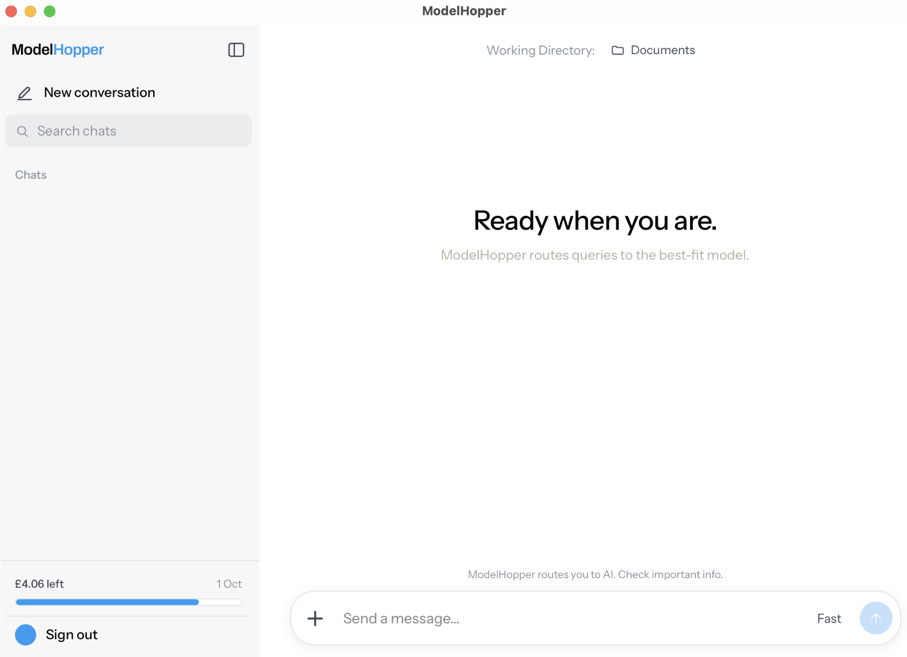
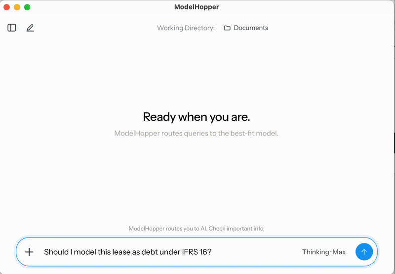
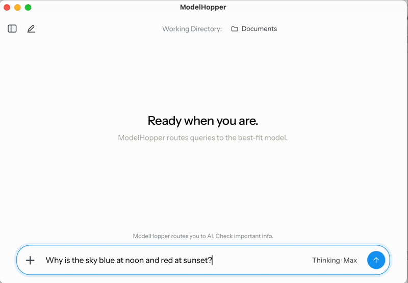
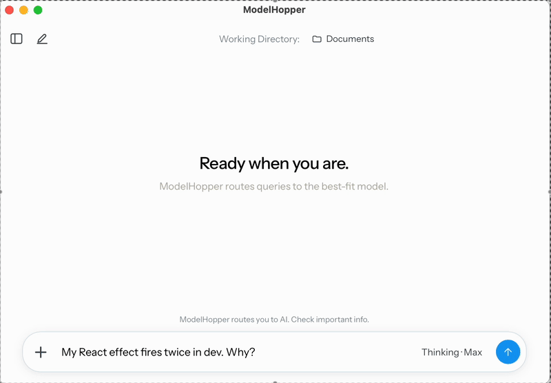
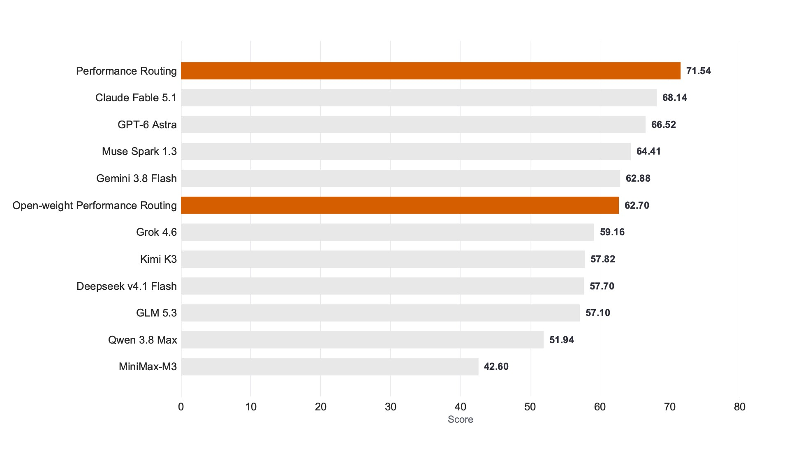

<div align="left">
  <picture>
    <source media="(prefers-color-scheme: dark)" srcset="docs/media/modelhopper-wordmark-dark.png">
    
  </picture>
</div>

<br>

## Main

A minimal AI chat client that routes each query to the strongest available model for the relevant domain, based on domain-specific benchmark performance. The frontend is built with React, Vite, and TypeScript, with Supabase providing the backend. A Tauri 2 wrapper packages the web frontend as a native desktop application.

Each query is first passed through a lightweight classifier (I used GPT-5.6 Luna) to identify the most relevant task domain. The request is then routed to the highest-ranked model for that domain. `pull_all_vals_benchmarks_flat.m` retrieves the latest domain-specific benchmark results from [Vals AI](https://vals.ai) and can be used to regenerate the routing table as benchmark results change.

Rather than storing a single model per domain, a routing table could be configured to contain several models in ranked order. Requests would then be attempted sequentially, with configurable timeouts and fallback behaviour, so that if the preferred model or provider is unavailable, rate-limited, or exceeds the latency threshold, the request is automatically routed to the next best available model. This improves resilience and reduces dependence on any single provider.



<table>
<tr>
<td width="33.3%"></td>
<td width="33.3%"></td>
<td width="33.3%"></td>
</tr>
<tr>
<td align="center">Finance &rarr; Gemini 3.8 Flash</td>
<td align="center">Science &rarr; GPT 6 Astra</td>
<td align="center">Coding &rarr; Claude Fable 5.1</td>
</tr>
</table>

## Routing Scores

On 17 Sep 2026, domain-specific routing outperformed the aggregate score of the best single model, Fable 5.1, which scored 68.1%, producing an estimated aggregate score of 71.5%. The improvement is approximately equal to the performance gap between Fable 5.1 and Muse Spark 1.3. The aggregate routing score was estimated using an approximation of [Vals AI's](https://vals.ai) aggregate scoring method.

This approach may also reduce average inference cost as lower cost models often lead individual domains. This avoids the need to send every request to the best performing model on aggregate, which is often the most expensive. Distributing requests across multiple providers can also reduce the impact of provider-specific outages, rate limits, and capacity constraints.

The same effect is particularly interesting when considering only open-weight models. On 17 Sep 2026, the strongest single open-weight model by aggregate performance was Kimi K3 at 57.8%. Domain-specific routing across open-weight models produced an estimated aggregate score of 62.7%, approximately matching Google’s latest model Gemini 3.8 Flash.

Domain-specific routing therefore narrows the aggregate performance gap between open-weight and frontier models while retaining advantages such as deployment flexibility, data sovereignty, and greater control over costs.



## Install and Run

The application requires 1) a Supabase project (the free tier is sufficient), 2) API keys for whichever model providers you want to use, 3) and Node.js 22 or 24. Nothing is tied to a specific deployment: the Supabase project reference, provider credentials, and model IDs are all supplied through your configuration.

```bash
npm install
cp apps/client/.env.example apps/client/.env   # your Supabase URL + publishable key
supabase link --project-ref <your-ref> && supabase db push
supabase config push                           # auth settings — read the note below first
supabase secrets set ANTHROPIC_API_KEY=...     # and any others you want
npm run dev
```

`db push` creates the database schema, but authentication behaviour is configured separately in `supabase/config.toml` and only reaches the linked project through `config push`. Skipping this step leaves sign-in non-functional: the application uses a 6-digit OTP rather than a magic-link flow, and the client sets `detectSessionInUrl: false`, so Supabase’s default magic-link email cannot establish a session.

`config push` applies the entire configuration file, so review it carefully before running it against any live project. The repository configuration uses `localhost:5173` for both `site_url` and `additional_redirect_urls`, which is appropriate for local development but must be changed for deployment. It also sets `enable_signup = true`, which will re-enable public sign-up if the target project currently has registration disabled. Once the project is in production, these settings are better managed deliberately in the Supabase dashboard rather than pushed unchanged from the development configuration.

The SMTP configuration expects `GMAIL_ADDRESS` and `GMAIL_APP_PASSWORD`. Supply both if you want to use a Gmail-backed SMTP sender. Otherwise, disable the custom SMTP block and use Supabase’s built-in mailer, accepting its lower sending limits.

Before connecting the application to Supabase, run `scripts/check-providers.ts`. It validates that your provider credentials and configured model IDs resolve correctly, allowing provider configuration issues to be caught independently of the backend. Compatibility checks are included for Gemini, OpenAI, and Anthropic-style APIs and were verified against the configured endpoints on 17 Sep 2026.

Provider availability degrades gracefully on Thinking>Max. If a provider key is missing, only the routing to that provider becomes unavailable rather than the application as a whole. However, a provider key must be specified for the classifier and for Fast and Thinking>Budget. I used an OpenAI API compatible model for these cases.

The desktop build is [apps/desktop](apps/desktop/README.md).

MIT licensed — see [LICENSE](LICENSE).
